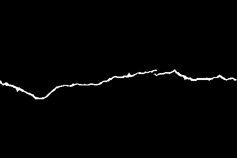
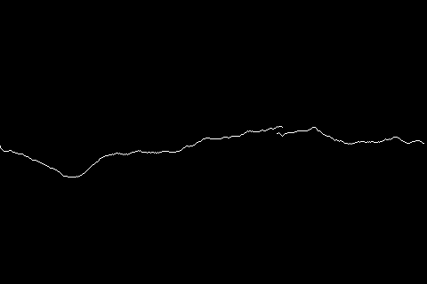

# Skeleton850 Dataset

## 1. Introduction

**Skeleton850** is an annotated crack skeletonization dataset for pavement crack detection and analysis. The dataset contains 850 crack mask images along with their corresponding skeletonized versions and preprocessed augmentations, designed to facilitate research in crack topology extraction, morphological analysis, and skeleton-based crack detection methods.

### Dataset Statistics

| Folder | # Images | Description |
|--------|----------|-------------|
| `original_mask/` | 850 | Original binary crack mask annotations |
| `skeletonized_mask/` | 850 | Skeletonized crack masks (single-pixel-width representations) |
| `skeletonized_mask_preprocessed/` | 3,530 | Preprocessed and augmented skeletonized masks |

All images are in **PNG** format.

### Dataset Structure

```
Skeleton850/
├── original_mask/                      # Original binary crack masks
│   ├── 00001.png
│   ├── 00002.png
│   └── ...                             # 850 images total
├── skeletonized_mask/                  # Skeletonized crack masks
│   ├── 00001.png
│   ├── 00002.png
│   └── ...                             # 850 images total
├── skeletonized_mask_preprocessed/     # Preprocessed & augmented skeletonized masks
│   ├── 0001.png
│   ├── 0002.png
│   └── ...                             # 3,530 images total
└── README.md
```

## 2. Sample Visualization

| Original Mask | Skeletonized Mask |
|:---:|:---:|
|  |  |

## 3. License

This dataset is made available for **non-commercial research purposes only**.

## 4. Citation

If you use the Skeleton850 dataset in your research, please cite the following paper:

```bibtex
@article{your_paper,
  title={Your Paper Title},
  author={Your Name and Co-Authors},
  journal={Journal/Conference Name},
  volume={},
  number={},
  pages={},
  year={2026},
  publisher={Publisher},
  doi={},
  url={Your Paper Link Here}
}
```

**Paper Link:** [Your Paper Title](https://doi.org/your-doi-link-here)

## 5. Source Datasets

The Skeleton850 dataset is derived from the following public pavement crack datasets through modification and re-annotation. Please also cite the corresponding papers when using these source datasets:

### CRACK500

```bibtex
@inproceedings{zhang2016road,
  title={Road crack detection using deep convolutional neural network},
  author={Zhang, Lei and Yang, Fan and Zhang, Yimin Daniel and Zhu, Ying Julie},
  booktitle={Image Processing (ICIP), 2016 IEEE International Conference on},
  pages={3708--3712},
  year={2016},
  organization={IEEE}
}

@article{yang2019feature,
  title={Feature Pyramid and Hierarchical Boosting Network for Pavement Crack Detection},
  author={Yang, Fan and Zhang, Lei and Yu, Sijia and Prokhorov, Danil and Mei, Xue and Ling, Haibin},
  journal={IEEE Transactions on Intelligent Transportation Systems},
  year={2019},
  publisher={IEEE}
}
```

### GAPs384

```bibtex
@article{yang2019feature,
  title={Feature Pyramid and Hierarchical Boosting Network for Pavement Crack Detection},
  author={Yang, Fan and Zhang, Lei and Yu, Sijia and Prokhorov, Danil and Mei, Xue and Ling, Haibin},
  journal={IEEE Transactions on Intelligent Transportation Systems},
  year={2019},
  publisher={IEEE}
}

@inproceedings{eisenbach2017how,
  title={How to Get Pavement Distress Detection Ready for Deep Learning? A Systematic Approach.},
  author={Eisenbach, Markus and Stricker, Ronny and Seichter, Daniel and Amende, Karl and Debes, Klaus
          and Sesselmann, Maximilian and Ebersbach, Dirk and Stoeckert, Ulrike
          and Gross, Horst-Michael},
  booktitle={International Joint Conference on Neural Networks (IJCNN)},
  pages={2039--2047},
  year={2017}
}
```

### CFD

```bibtex
@article{shi2016automatic,
  title={Automatic road crack detection using random structured forests},
  author={Shi, Yong and Cui, Limeng and Qi, Zhiquan and Meng, Fan and Chen, Zhensong},
  journal={IEEE Transactions on Intelligent Transportation Systems},
  volume={17},
  number={12},
  pages={3434--3445},
  year={2016},
  publisher={IEEE}
}
```

### cracktree200

```bibtex
@article{zou2012cracktree,
  title={CrackTree: Automatic crack detection from pavement images},
  author={Zou, Qin and Cao, Yu and Li, Qingquan and Mao, Qingzhou and Wang, Song},
  journal={Pattern Recognition Letters},
  volume={33},
  number={3},
  pages={227--238},
  year={2012},
  publisher={Elsevier}
}
```

## 6. History

- **Version 1.0** (2026/02) — Initial release
